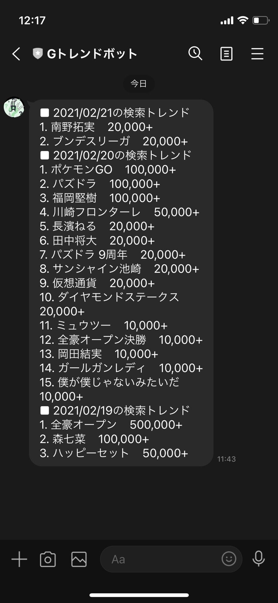
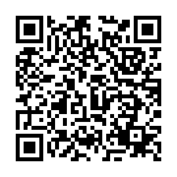

# GtrendsLineBot

## 利用者したAPI

+ Messaging API

[https://developers.line.biz/ja/services/messaging-api/](https://developers.line.biz/ja/services/messaging-api/)

+ GtrendsApi(自作)

[https://gtrends-api-ss.herokuapp.com/](https://gtrends-api-ss.herokuapp.com/)

## できたもの

+ 11:30 PM UTC(08:30 AM JST)にGoogleトレンドの急上昇ワードを通知する

+ QRコード

